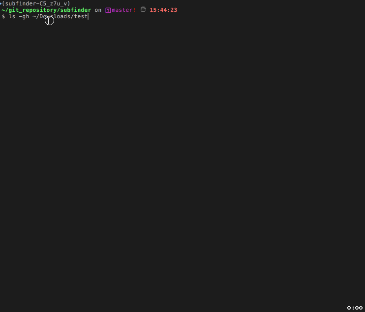

# subfinder 字幕查找器

subfinder 是一个通用字幕查找器，可以查找字幕并下载。

---

---

Table of Contents
=================

   * [subfinder 字幕查找器](#subfinder-字幕查找器)
   * [Table of Contents](#table-of-contents)
      * [特性](#特性)
      * [安装](#安装)
      * [更新](#更新)
      * [使用方法](#使用方法)
         * [命令行](#命令行)
         * [Windows 右键菜单](#windows-右键菜单)
         * [macOS 右键菜单](#macos-右键菜单)
      * [图形界面](#图形界面)
      * [注意事项](#注意事项)
         * [shooter 字幕搜索器](#shooter-字幕搜索器)
         * [zimuku 字幕搜索器](#zimuku-字幕搜索器)
      * [扩展](#扩展)
         * [subfinder 架构](#subfinder-架构)
         * [自定义字幕搜索器](#自定义字幕搜索器)
      * [贡献](#贡献)
      * [参考](#参考)
      * [License](#license)
      * [更新历史](#更新历史)
         * [v1.0.6](#v106)
         * [v1.0.5](#v105)
         * [v1.0.4](#v104)
         * [v1.0.3](#v103)
         * [v1.0.2](#v102)
         * [v1.0.1](#v101)

---

## 特性

- 支持射手字幕网提供的 API，可以精确匹配字幕。

- 支持从 [字幕库](https://www.zimuku.cn/) 搜索字幕。

- 支持从 [字幕组](http://www.zimuzu.io/) 搜索字幕。

- 支持指定语言和格式查找字幕。

- 自动将字幕下载至和视频文件相同的目录，自动将字幕文件重命名为视频文件名，方便播放器自动加载字幕。

- 支持线程和协程并发下载。

- 支持 python2 和 python3。

- 支持全平台（Windows、macOS 和 Linux）

## 安装

如果你是 Linux 和 macOS 用户，由于系统自带 Python，推荐使用下面的方法安装 subfinder：

`pip install subfinder`

安装完成之后，会在 Python 的 scripts 目录下添加一个叫做 subfinder 的可执行文件。

> 在 unix-like 系统中，scripts 目录一般是 `/usr/local/bin`，在 Windows 系统中，scripts 目录一般是 `C:\python\scripts\`。在 Windows 系统中需要将 `C:\python\scripts\` 加入到 `PATH` 中（一般安装 Python 时已经添加了）。

接下来你就可以在命令行中使用 subfinder 命令了。

为了方便没有安装 Python 的用户，这里也有已经打包好的可执行文件。[戳这里下载](https://github.com/ausaki/subfinder/releases)。

## 更新

如果 subfinder 是使用 pip 安装的，那么使用 pip 更新，

`pip install subfinder --upgrade`

如果 subfinder 是下载的打包好的可执行文件，那么请重新下载最新的可执行文件并覆盖旧的文件。

## 使用方法

### 命令行

- 使用默认字幕查找器（shooter）查找单个视频的字幕：

  `subfinder /path/to/videofile`

- 使用默认字幕查找器（shooter）查找目录下（递归目录）所有视频的字幕：

  `subfinder /path/to/directory_contains_video`

- 使用指定的字幕查找器查找字幕，例如 zimuku：

  `subfinder /path/to/directory_contains_video -m zimuku`

- 同时使用多个字幕查找器查找字幕

  `subfinder /path/to/directory_contains_video -m shooter zimuku`

  当指定多个字幕查找器时，subfinder 会依次尝试每个字幕查找器去查找字幕，只要有一个字幕查找器返回字幕信息，则不再使用后面的字幕查找器查找字幕。

  **注意：** 如果指定了多个字幕查找器，请不要指定 `languages` 参数，否则可能会出现 `LanguageError` 错误（因为每个 `SubSearcher` 支持的语言可能不相同）。

常用参数说明（详细的参数信息请查看 `subfinder -h`）：

| 参数              | 含义                                                                                               | 必需                                               |
| ----------------- | -------------------------------------------------------------------------------------------------- | -------------------------------------------------- |
| `-l, --languages` | 指定字幕语言，可同时指定多个。每个字幕查找器支持的语言不相同。具体支持的语言请看下文。             | 否，subfinder 默认会下载字幕查找器找到的所有字幕。 |
| `-e, --exts`      | 指定字幕文件格式，可同时指定多个。每个字幕查找器支持的文件格式不相同。具体支持的文件格式请看下文。 | 否，subfinder 默认会下载字幕查找器找到的所有字幕。 |
| `-m,--method`     | 指定字幕查找器，可同时指定多个。                                                                   | 否，subfinder 默认使用 shooter 查找字幕。          |

支持的语言和文件格式：

| 字幕查找器 | 语言                                | 文件格式       |
| ---------- | ----------------------------------- | -------------- |
| shooter    | ['zh', 'en']                        | ['ass', 'srt'] |
| zimuku     | ['zh_chs', 'zh_cht', 'en', 'zh_en'] | ['ass', 'srt'] |
| zimuzu     | ['zh_chs', 'zh_cht', 'en', 'zh_en'] | ['ass', 'srt'] |

语言代码：

| 代码   | 含义               |
| ------ | ------------------ |
| zh     | 中文，简体或者繁体 |
| en     | 英文               |
| zh_chs | 简体中文           |
| zh_cht | 繁体中文           |
| zh_en  | 双语               |

### Windows 右键菜单

使用命令行下载字幕还是有一点不方便，特别是需要输入路径。

在 widnows 中，可以通过注册表将 subfinder 添加到右键菜单，使用时右键选中视频文件或者文件夹，然后点击右键菜单中的 “查找字幕”。

**如何添加注册表：**

- 下载 [注册表文件](https://raw.githubusercontent.com/ausaki/subfinder/master/assets/subfinder.reg)，

- 双击注册表文件 subfinder.reg 即可添加注册表到系统中。

### macOS 右键菜单

在 macOS 中，通过 Automator 的 Service 实现类似于 Windows 中的右键菜单功能。

使用方法：

- [下载 workflow](https://raw.githubusercontent.com/ausaki/subfinder/master/assets/subfinder.workflow.tar.gz)。
- 解压 subfinder.workflow.tar.gz。
- 将解压出的 subfinder.workflow 复制到 / Users/YourName/Library/Services。
- 选中视频文件或目录，右键弹出菜单，选择 “服务（Services）” -> “查找字幕”。

**注意：在 workflow 中，subfinder 的路径是 `/usr/local/bin/subfinder`。**

如果想要了解如何配置 workerflow，可以参考:

- [macOS Automator 帮助](https://support.apple.com/zh-cn/guide/automator/welcome/mac)
- [stackexchange 的这篇回答](https://apple.stackexchange.com/questions/238948/osx-how-to-add-a-right-click-option-in-folder-to-open-the-folder-with-an-applic?utm_medium=organic&utm_source=google_rich_qa&utm_campaign=google_rich_qa)

## 图形界面

打包好的可执行文件其实是一个 GUI app，不带任何参数运行的话，会打开一个图形界面。

**注意**

- GUI app 默认同时使用 shooter 和 zimuku 两个字幕搜索器。

- GUI app 同样支持命令行参数。

[下载页面](https://github.com/ausaki/subfinder/releases)

## 注意事项

### shooter 字幕搜索器

- 由于射手字幕网爬虫的实时性，可能无法查找到最新发布视频的字幕。
- 射手字幕网 API 返回的字幕可能出现 “语言不一致” 问题（指定查找英文字幕却返回中文字幕）。

### zimuku 字幕搜索器

- zimuku 网站明明有字幕可供下载，subfinder 却提示找不到字幕。可能的原因有：

  - zimuku 字幕搜索器从视频文件名中提取的关键词不够准确，导致搜索结果为空。

  - zimuku 网站修改了 HTML 代码，导致 HTML 解析失败。

- 从 zimuku 网站上下载的字幕一般都是压缩包（zip, rar）。Python 自带的 zipfile 标准库可以解压 zip 压缩包，不过解压 rar 压缩包需要操作系统安装有 unrar 工具。由于 windows 系统安装和配置 unrar 比较麻烦，subfinder 已经內建 unrar.exe 了。对于 Linux 和 macOS 系统的用户，需要自己手动使用系统包管理工具安装 unrar。

## 扩展

subfinder 的定位是支持第三方扩展的通用字幕查找器。

### subfinder 架构

**class subfinder.subfinder.SubFinder**

`SubFinder` 类定义在 `subfiner/subfiner.py` 中。

`SubFinder` 负责的功能有：

- 收集指定目录下所有的视频文件。

- 调用指定的 `SubSearcher` 查找字幕。

- 下载字幕。

方法：

- `__init__(self, path='./', languages=None, exts=None, subsearcher_class=None, **kwargs)`

  | 参数              | 介绍                                                      | 类型                                 |
  | ----------------- | --------------------------------------------------------- | ------------------------------------ |
  | path              | 文件名或者目录                                            | str                                  |
  | languages         | 字幕语言， 如果为 None，则由 `subsearcher_class` 自己决定 | str or [str]                         |
  | exts              | 字幕格式，如果为 None，则由 `subsearcher_class` 自己决定  | str or [str]                         |
  | subsearcher_class | 字幕搜索器，默认是 `ShooterSubSearcher`                   | BaseSubSearcher or [BaseSubSearcher] |

  **注意：** 如果指定了多个 `subsearcher_class`，请不要指定 `languages` 参数，否则可能会出现校验错误（LanguageError），因为每个 `SubSearcher` 支持的语言可能不相同。

- `start()`

  开始查找字幕

- `done()`

  查找字幕完成后调用，进行一些收尾工作。

你基本上不用修改 `SubFinder` 类，只需要自定义 `SubSearcher` 即可。

更多关于 `SubFinder` 的细节请查看源码。

`SubFinder` 默认是单线程的，效率有点低，因此基于 `SubFinder` 实现了两个分别基于 gevent 和 thread 的子类。

**class subfinder.subfinder_thread.SubFinderThread**

`SubFinderThread` 类定义在 `subfiner/subfiner_thread.py` 中，`SubFinderThread` 重写了 `SubFinder` 的 `_init_pool` 方法，使用线程池去查找字幕和下载字幕。

**class subfinder.subfinder_gevent.SubFinderGevent**

`SubFinderGevent` 类定义在 `subfiner/subfiner_gevent.py` 中，`SubFinderGevent` 重写了 `SubFinder` 的 `_init_pool` 方法，使用协程池去查找字幕和下载字幕。

如果使用 `SubFinderGevent` ，需要在你的入口文件的第一行进行 patch:

    `from gevent import monkey;monkey.patch_all()`

**class subfinder.subsearcher.SubSearcher**

`SubSearcher` 类定义在 `subfinder/subsearcher.py 中 `，`SubSearcher` 负责查找字幕。

类属性：

- `SUPPORT_LANGUAGES`， 支持的字幕语言， 如 chn、eng。`SUPPORT_LANGUAGES` 用于检查命令行的 `languages` 参数是否合法。

- `SUPPORT_EXTS`， 支持的字幕格式，如 ass、srt。`SUPPORT_EXTS` 用于检查命令行的 `exts` 参数是否合法。

方法：

- `search_subs(self, videofile, languages=None, exts=None, **kwargs)`， 查找字幕。

  | 参数      | 介绍                 | 类型         |
  | --------- | -------------------- | ------------ |
  | videofile | 视频文件名的绝对路径 | str          |
  | languages | 字幕语言             | str or [str] |
  | exts      | 字幕格式             | str or [str] |

  返回字幕信息列表，字幕信息的格式: `{'link': LINK, 'language': LANGUAGE, 'subname': SUBNAME,'ext': EXT, 'downloaded': False}`。

  格式：

  | 字段       | 介绍                                                                                                                                                           | 类型         |
  | ---------- | -------------------------------------------------------------------------------------------------------------------------------------------------------------- | ------------ |
  | link       | 字幕文件下载地址，可选，取决于 `downloaded`，如果 `downloaded` 为 False，则必须提供                                                                            | str          |
  | language   | 字幕语言                                                                                                                                                       | str or [str] |
  | exts       | 字幕格式                                                                                                                                                       | str or [str] |
  | subname    | 字幕文件名，可选，取决于 `downloaded`，如果 `downloaded` 为 False，则必须提供                                                                                  | str or [str] |
  | downloaded | `SubSearcher` 是否已经下载好了字幕。如果为 True，表示 `SubSearcher` 已经下载了字幕，那么 `SubFinder` 将不会下载字幕，否者 `SubFinder` 会根据 `link` 下载字幕。 | bool         |

### 自定义字幕搜索器

为了实现你自己的字幕搜索器，你需要：

- 创建一个继承自 `BaseSubSearcher` 的类，实现 `search_subs` 方法，重写 `SUPPORT_LANGUAGES` 和 `SUPPORT_EXTS` 属性。

- 注册你自己的 `SubSeacher` 类。

这里有一个自定义字幕搜索器的 [示例文件](examples/custom_subsearcher.py)。

## 贡献

在使用过程中遇到任何问题，请提交 issue。

如果你希望分享你自己的字幕搜索器，欢迎提交 PR。

## 参考

- [射手字幕网 API 使用文档](https://docs.google.com/document/d/1ufdzy6jbornkXxsD-OGl3kgWa4P9WO5NZb6_QYZiGI0/preview)

- [射手字幕网 API](https://www.shooter.cn/api/subapi.php)

## License

[MIT License](LICENSE)

## 更新历史

### v1.0.5

- 优化了 subsearcher。

- 添加--debug选项，方便显示调试信息。

### v1.0.5

- 修复命令行参数`-l`，`-e`的问题。

### v1.0.4

- 新增 zimuzu 字幕搜索器。

- 优化代码。

### v1.0.3

- 优化 zimuku 字幕搜索器。

- 內建 unrar.exe，windows 用户不用安装 unrara 了。

### v1.0.2

- GUI app 同时使用 shooter 和 zimuku 两个字幕搜索器搜索字幕。

- GUI app 支持命令行运行。

- 完善打包 GUI app 的流程。

### v1.0.1

- 完善 ZimukuSubsearcher。

  - 解压字幕压缩包文件时，只解压字幕文件。字幕组上传的字幕压缩包文件中可能包含其它非字幕文件。

  - 完善搜索功能。

- 完善打包方式。

- 修复一些 bug。
